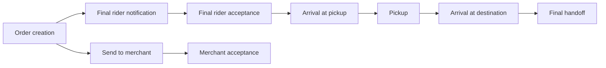

# Operational Process and KPI Map

The merchant branch can overlap rider dispatch. The first five solid rider-path intervals form the additive creation-to-destination duration. Final handoff is shown separately because it is outside the endpoint matched by the platform's declared `tiempo_real` field. No timestamp records the first offer or each rejected assignment.

| Stage | Mean minutes | P90 minutes | Share |
|---|---|---|---|
| Creation to final rider notification | 10.58 | 23.93 | 41.1% |
| Final rider notification to acceptance | 0.25 | 0.54 | 1.0% |
| Final rider approach to merchant | 3.13 | 6.60 | 12.2% |
| Final rider waiting at pickup | 4.60 | 9.82 | 17.9% |
| Pickup to destination arrival | 7.17 | 12.56 | 27.9% |

[Evidence](../outputs/analysis/stage_summary.csv)

Process metrics use a common completed cohort with every stage present and nonnegative. Signed merchant-acceptance-to-notification time is retained as an overlap diagnostic. A negative signed branch interval is not erased or added to a truncated process total.
